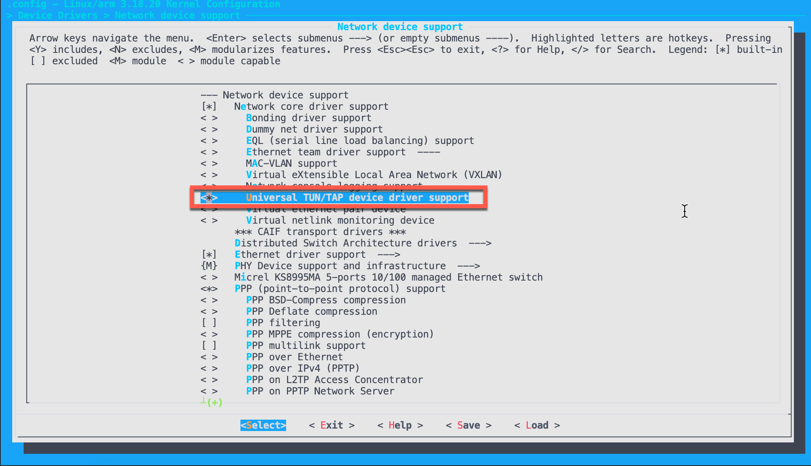

# Mesh VPN solution for Embedded Linux Modules
## What is mesh-vpn solution `tailscale`

In `tailscale` [website](https://tailscale.com/kb/1151/what-is-tailscale/) explains well about how tailscale works.

> Tailscale is a modern VPN built on top of Wireguard. It works like an overlay network between the computers of your networks - using NAT traversal.
>
> Everything in Tailscale is Open Source, except the GUI clients for proprietary OS (Windows and macOS/iOS), and the control server.
>
> The control server works as an exchange point of Wireguard public keys for the nodes in the Tailscale network. It assigns the IP addresses of the clients, creates the boundaries between each user, enables sharing machines between users, and exposes the advertised routes of your nodes.
>
>A Tailscale network (tailnet) is private network which Tailscale assigns to a user in terms of private users or an organisations.
> Ref: https://github.com/juanfont/headscale

Traditional VPN solution: The central gateway may or may not be close to users, thus resulting in higher latency. Because traffic is centralized, it can also act as a bottleneck, slowing down connections further.


With Tailscale, each device is connected to the other directly, resulting in lower latency.


## Usage
This solution apply only for QuecOpen based modules with Qualcom chipset like EC21, EC25, AG35, SmartModule SC20, ... and you have access to QuecOpen firmware/SDK.

In order to get access to QuecOpen firmware/SDK, pls contact the Quectel FAE/Sales at your regions.

This solution is not limited into only Embedded Linux devices, but also can be used for daily development.

## How to integrate into QuecOpen

### Enable kernel module `tun`

`tun` kernel module is needed for the VPN solution as described in the [Linux document](https://www.kernel.org/doc/Documentation/networking/tuntap.txt).
> TUN/TAP provides packet reception and transmission for user space programs.
  It can be seen as a simple Point-to-Point or Ethernet device, which,
  instead of receiving packets from physical media, receives them from
  user space program and instead of sending packets via physical media
  writes them to the user space program.

By default, the QuecOpen kernel module `tun` is not enabled. This can be done by enable `tun` kernel module in `make kernel_menuconfig` or add config `CONFIG_TUN=y` in the `.config`



and then rebuild the kernel and rootfs:

```console
make kernel
make kernel_module
make rootfs
```

Via `adb` conection and at `target` folder, the kernel/rootfs can be flashed into the QuecOpen module with below script:

```bash
#!/bin/sh

adb reboot bootloader
sleep 10

fastboot flash system mdm9607-perf-sysfs.ubi
fastboot flash boot mdm9607-perf-boot.img

fastboot reboot

```

### Download `tailscale` into target module

`tailscale` has pre-built binaries for various target architectures at [tailscale mainstream](https://pkgs.tailscale.com/stable/#static), thus just download the `arm` target binary for EC2x module.

```console
wget https://pkgs.tailscale.com/stable/tailscale_1.22.2_arm.tgz
tar xvf tailscale_1.22.2_arm.tgz
```

The current tailscale packages are quite big about 11MB for `tailscale` and 19MB for `tailsacled`. This is needed to recompile `tailscale` for this target, however, it is not covered in this article.

```console
cd tailscale_1.22.2_arm
ls -lah
total 60400
drwxr-xr-x    5 bacnh  staff   160B Mar 27 11:05 .
drwx------@ 188 bacnh  staff   5.9K Mar 27 11:04 ..
drwxr-xr-x    4 bacnh  staff   128B Mar 27 11:05 systemd
-rwxr-xr-x    1 bacnh  staff    11M Mar 18 09:43 tailscale
-rwxr-xr-x    1 bacnh  staff    19M Mar 18 09:43 tailscaled
```

Let's copy over the target module:

```console
adb push tailscale* /usrdata
```

### Integrate `tailscale` into the rootfs

Once Mesh VPN solution is sastisfied, we can integrate `tailscale` into QuecOpen rootfs:

The same approach like other package integration, below steps are needed.
1. Copy binaries `tailscale`, `tailscaled` into `ql-ol-rootfs/usr/bin`
2. Create startup script tailscaled in `ql-ol-rootfs/etc/init.d/tailscaled`

```bash
#! /bin/sh

set -e

case "$1" in
       start)
                echo -n "Starting tailscaled: "
                start-stop-daemon -S -b -a /usr/bin/tailscaled
                echo "done"
                ;;
       stop)
                echo -n "Stopping tailscaled: "
                start-stop-daemon -K -n tailscaled
                echo "done"
                ;;
       restart)
                $0 stop
                $0 start
                ;;
       *)
                echo "Usage: tailscaled { start | stop | restart }" >&2
                exit 1
                ;;
esac

exit 0
```
3. Create link into `ql-ol-rootfs/etc/rc5.d` so `tailscaled` scrip is running at startup


## Establish `tailscale` network with EC25-E QuecOpen

### Step 1: Establish data call to obtain network access

This can be done using `example_data_call_v2` with little modification to obtain network with 1 profile:

```console
root@mdm9607-perf:/usrdata# ./example_data_call_v2
the profile index 1 start data call success
profile id 1 IP family v4 is Connected
Interface Name: rmnet_data0
IP address:          29.135.90.95
Gateway address:     0.0.0.0
Primary DNS address: 203.113.131.6
Second DNS address:  203.113.131.5
```

There must be a `rmnet_data0` internet intnerface with WAN IP and module can access to global Internet:
```console
root@mdm9607-perf:/usrdata# ifconfig
bridge0   Link encap:Ethernet  HWaddr 22:DE:0F:E0:37:C7  
          inet addr:192.168.225.1  Bcast:192.168.225.255  Mask:255.255.255.0
          inet6 addr: fe80::20de:fff:fedd:34c4/64 Scope:Link
          UP BROADCAST MULTICAST  MTU:1500  Metric:1
          RX packets:0 errors:0 dropped:0 overruns:0 frame:0
          TX packets:1 errors:0 dropped:0 overruns:0 carrier:0
          collisions:0 txqueuelen:0 
          RX bytes:0 (0.0 B)  TX bytes:76 (76.0 B)

lo        Link encap:Local Loopback  
          inet addr:127.0.0.1  Mask:255.0.0.0
          inet6 addr: ::1/128 Scope:Host
          UP LOOPBACK RUNNING  MTU:65536  Metric:1
          RX packets:0 errors:0 dropped:0 overruns:0 frame:0
          TX packets:0 errors:0 dropped:0 overruns:0 carrier:0
          collisions:0 txqueuelen:0 
          RX bytes:0 (0.0 B)  TX bytes:0 (0.0 B)

rmnet0    Link encap:UNSPEC  HWaddr 00-00-00-00-00-00-00-00-00-00-00-00-00-00-00-00  
          UP RUNNING  MTU:2000  Metric:1
          RX packets:0 errors:0 dropped:0 overruns:0 frame:0
          TX packets:5 errors:0 dropped:0 overruns:0 carrier:0
          collisions:0 txqueuelen:1000 
          RX bytes:0 (0.0 B)  TX bytes:388 (388.0 B)

rmnet_data0 Link encap:UNSPEC  HWaddr 00-00-00-00-00-00-00-00-00-00-00-00-00-00-00-00  
          inet addr:29.135.90.95  Mask:255.255.255.192
          inet6 addr: fe80::15b7:6390:3222:18fe/64 Scope:Link
          UP RUNNING  MTU:1500  Metric:1
          RX packets:0 errors:0 dropped:0 overruns:0 frame:0
          TX packets:5 errors:0 dropped:0 overruns:0 carrier:0
          collisions:0 txqueuelen:1000 
          RX bytes:0 (0.0 B)  TX bytes:388 (388.0 B)
```

### Step 2: Start tailscaled and register device

Start tailscale daemon and register device:

```console
root@mdm9607-perf:/usrdata# ./tailscaled &
```

Register device:
```console
root@mdm9607-perf:/usrdata# ./tailscale status
Logged out.
root@mdm9607-perf:/usrdata# ./tailscale up

To authenticate, visit:

	https://login.tailscale.com/a/a1f81d7c76a5
```

After the 2nd command, there will be a authentication link, copy over to the Ineternet browser to authenticate this device and add into your tailscale network. And the module IP will be apear into the `Tailcale admin` and in the device list.

```console
root@mdm9607-perf:/usrdata# ./tailscale status
100.80.159.15   mdm9607-perf         bacnh85@     linux   -
100.71.84.58    bacnh-mbp            bacnh85@     macOS   -
```

And any device in my `tailscale` network can ping and access to each other via their VPN IPs. In this setup, IP for EC25-E is `100.80.159.15` - which is unchanged - so it is considered a static IP in the `tailscaled` network.

Inside QuecOpen module, there is a new tailscale network:

```console
root@mdm9607-perf:~# ifconfig tailscale0
tailscale0 Link encap:UNSPEC  HWaddr 00-00-00-00-00-00-00-00-00-00-00-00-00-00-00-00  
          inet addr:100.80.159.15  P-t-P:100.80.159.15  Mask:255.255.255.255
          inet6 addr: fd7a:115c:a1e0:ab12:4843:cd96:6250:9f0f/128 Scope:Global
          UP POINTOPOINT RUNNING NOARP MULTICAST  MTU:1280  Metric:1
          RX packets:1 errors:0 dropped:0 overruns:0 frame:0
          TX packets:1 errors:0 dropped:0 overruns:0 carrier:0
          collisions:0 txqueuelen:500 
          RX bytes:67 (67.0 B)  TX bytes:40 (40.0 B)
```
As device is registered, so everytime `tailscaled` starts, it will automatically register annd obtain network IP:

```console
root@mdm9607-perf:/usrdata# ./tailscaled
logtail started
Program starting: v1.22.2-t60b671955-gecc5d9846, Go 1.17.8-tsdce70b6d32: []string{"./tailscaled"}
LogID: bf226a22e13a81e62367c848f52adde28b0b7b9977f5e946d810e7351490e670
logpolicy: using system state directory "/var/lib/tailscale"
wgengine.NewUserspaceEngine(tun "tailscale0") ...
router: v6nat = false
dns: [rc=unknown ret=direct]
dns: using *dns.directManager
link state: interfaces.State{defaultRoute=rmnet_data0 ifs={bridge0:[192.168.225.1/24] rmnet_data0:[21.179.125.39/28]} v4=true v6=false}
magicsock: disco key = d:45356eb90ed05922
Creating wireguard device...
Bringing wireguard device up...
Bringing router up...
Clearing router settings...
Starting link monitor...
Engine created.
external route: up
```

## Use cases and Scenario

### How to `telnet` to QuecOpen device remotely

By default, `telnetd` daemon is not runnning, thus we need to start this daemon as background service:

```console
root@mdm9607-perf:~# /sbin/telnetd &
```
Then, you can access to the module via VPN IP from other device:

```console
bacnh@mbp ~ % telnet 100.80.159.15
Trying 100.80.159.15...
Connected to 100.80.159.15.
Escape character is '^]'.

msm 201903061755 mdm9607-perf


mdm9607-perf login: root
Password: 
root@mdm9607-perf:~# 
```

### How to debug device remotely via `adb`

By default, `adbd` service is already runnning at QuecOpen module with both serial and IP with port `55555`.

```
bacnh@mbp ~ % adb shell 100.80.159.15 55555

mdm9607-perf login: root
root
Password: quectel123

root@mdm9607-perf:~#
```

thus, developers can develop/debug QuecOpen apps remotely.

## FAQ

1) How many devices can be supported in this solution

Tailscale free version for personal can support upto 20 devices which is more enough for application troubleshooting during development phase. If customer wants to deploy the mesh VPN solutionn for commercial usage, `enterprise` subcription could be used - pls refer to [Tailscale price](https://tailscale.com/pricing/)

Other fully opensource solution can be done using `headscale` [solution](https://github.com/juanfont/headscale) - which is not covered in this article. Only changes in that, device  will register to  `headscale` server, instead of `tailscale`  server.

> headscale aims to implement a self-hosted, open source alternative to the Tailscale control server. headscale has a narrower scope and an instance of headscale implements a single Tailnet, which is typically what a single organisation, or home/personal setup would use.


2) How to access other devices under QuecOpen modules

There are several solutions:
- QuecOpen module itself can port forward the needed access port of the other device
- Using `tailscale` [subnet relay](https://tailscale.com/kb/1019/subnets/), however the end-device could be have same IP and you may not able to distinguish which IP belongs to the QuecOpen module

